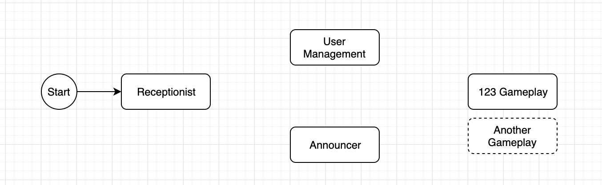

[Kafka](#afka)
  - [What is kafka? Concepts?](#what-is-kafka-concepts)
  - [Kafka as queuing or publish-subscribe model?](#kafka-as-queuing-or-publish-subscribe-model)
  - [Mechanism](#mechanism)
  - [What is consumer group?](#what-is-consumer-group)
  - [Replication](#replication)
  - [Zookeper](#zookeper)
    - [Producer/Consumer làm gì để biết được leader của một partition](#producerconsumer-l%c3%a0m-g%c3%ac-%c4%91%e1%bb%83-bi%e1%ba%bft-%c4%91%c6%b0%e1%bb%a3c-leader-c%e1%bb%a7a-m%e1%bb%99t-partition)
  - [Refference](#refference)


# Kafka
research and demo application about kafka 
- What is kafka? Concepts?
- What is kafka producer/ kafka consumer?
- Kafka as queuing or publish-subscribe model?
- What is topic?
- What is partition?
- What is consumer group?
- When will commit log (offset)?
- implements simple kafka client and control kafka client

## What is kafka? Concepts?

Kafka là distributed steam platform. được sử dụng cho các hệ thống real-time stream data gửi data từ server này đến server khác, có thể được dùng cho hệ thống lưu trữ có khả năng chịu lỗi.

Có một số khái niệm trong kafka
- Kafka được thực thi như là một cluster chạy trên một hay nhiều server 
- Kafka cluster lưu trữ stream of record trong categories được gọi là topics
- Mỗi record chứa key,value và timestramp
- Record: Producer sends messages to Kafka in the form of records. một record là một cặp key-value, chứa topics name và số partition sẽ được gửi đi, lên đó thì kafka broker sẽ lưu lại các record trong topic partirion. 
- Topics: producer write một record lên một topic và consumer listen từ đó. Một topics có thể có nhiều partition nhưng chứa ít nhất là một
- Partition: một topic partition mà một đơn vị thực thi song song trong kafka. nhiều coonsusmer không để consum từ một parttion đồng thời nhưng một consumer có thể consum nhiều partition đồng thời.
- Offset: một index trong partition
- producer: tạo ra các record and publishes chúng lên broker. producer có chức năng chọn ra các record được gửi lên partition nào với topic tương ứng. nếu không cấu hình việc chọn partition cụ thể nào thì nó sẽ chọn `round robin`. API của producer cho phép ta cấu hình dựa trene
  - Partition id với các message cụ thể 
  - có thể dựa vaò `key % number partition`
  - round robin nếu không có bất cứ cấu hình gì.
- Consumer: consumse record từ broker


Kafka có 4 core Api chính
- Produver API: cho phép ứng dụng push a stream of record đến một hay nhiều kafka topic.
- Consumer API: cho phép ứng dụng subscribe đến một hay hiều topics và xử lí stream of record
- Stream  API: cho phép ứng dụng xử lí như là một streaming processor, comsuming input stream từ một hay nhiều topics và producing output streaming đến một hay nhiều topics output khác, chuyển đổi hiệu quả các input streaming đến các output streaming.
- Connector API: cho phép xây dụng và chạy lại các producer hoặc comsumer cái mà kết nói với kafka topic đến các application hoặc data system.

Trong kafka thì việc giao tiếp giữa client và server thông qua TCP protocol với high-performance, protocol này được đánh dấu version và cho phép khả năng tương thích ngược với các version cũ hơn. Hơn nữa chúng còn cung cấp khả năng horizontal scale thông qua sharding bằng cách sharding chúng ra thành nhiều partition trên các server khác nhau.

## Why kafka so fast

Kafka dựa trên hệ điều hành để  move data nhanh nhất có thể, dựa vào việc ghi theo một trình tự nhất định do đó tránh được các trường hợp random access và tìm kiếm tốn kém trên các thanh đọc dưới đĩa cuả hệ điều hành. kafka cũng cung cấp cơ chế cho việc horizontal scale thông qua sharding. vì ta có thể  chia topic trên nhiều broker và trong topic có thể chia ra nhiều partition trên nhiều máy chủ khác nhau để tăng hiệu suất của hệ thống.

## Kafka as queuing or publish-subscribe model?

Kafka is a distributed publish-subscribe messaging system and a robust queue that can handle a high volume of data and enables you to pass messages from one end-point to another.

## Mechanism

Các producer gửi các messages(records) đến các node của kafka được gọi là broker và Chúng sẽ được xử lí bởi các consumer. Các messages như đã nói ở trên lưu trữ trong một topic và các consumers theo dõi topic đó để nhận các messages.

Các topic có thể có nhiều partition để có thể tăng performance của hệ thống và dễ dàng scalability, vì ở mỗi partition trong topics, các consumer có thể xử lí đồng thời ở nhiều partition khác nhau. Kafka đảm bảo rằng các partition sẽ đến đúng thứ tự khi gửi từ producer đến topics. Có thể phần biệt messages cụ thể thông qua offet, có thể xem nó như là một mảng, partition là một array, còn offset là index trên array đó, các consumer có thể lựa chọn vị trí của offset trên partition.


Kafka hoạt động theo nguyên tắc `dumb broker` và `smart consumer`. Kafka sẽ không quan tâm consumer nào đã đọc các records và có thể xóa các record đó sau một khoảng thời gian thiết lập hoặc đến ngưỡng mà các consumer vẫn không để mất các dữ liệu đó nhờ cơ chế commit log. Tự các consumer sẽ xem xét trên kafka để biết các messeage mới đến và yêu cầu các message muốn đọc trên đó, consumer lưu lại các meta data là thông tin về index của các partition trên topic. điều này giúp các consumer tự điều chỉnh được offset mà mình muốn đọc và xử lí phù hợp.

`Commit log`: là cấu trúc dữ liệu đảm bảo trình tự thêm vào của các offset và chỉ hỗ trợ ghi thêm vào(append) và persist chúng xuống đĩa.
- Chi phí đọc và ghi là O(1) khi biết được id của các record
- Đọc và viết không ảnh hưởng đến nhau, và không block nhau.

## What is consumer group?

các consumers hoạt động theo các nhóm consumer gọi là các consumer groups. Trong consumer group thì các consumer hoạt động trên các partition khác nhau, tránh việc hai consumer trong cùng một group lại gắn với một partition trên topics.


## Replication

Kafka đảm bảo được fault-tolerance bằng cách sử dụng replication.

- DỮ liệu trong partition được replicate ra nhiều broker khác nhau để tránh trường hợp broker down dẫn đến kafka gặp vấn đề down hoặc mất dữ liệu, được gọi là followers, còn nơi được replicate được gọi là leader.
-   một Broker sẽ "làm chủ" một partition và đó cũng là node mà ứng dụng sẽ đọc/ghi dữ liệu từ partition (thuộc sở hữu của broker đó). Và partition này được gọi là partition leader. Partition này sẽ replicate dữ liệu mà nó nhận được đến N partitions ở các brokers khác - gọi là các partition followers. Các partition này cũng sẽ lưu trữ dữ liệu và sẵn sàng cho việc được bầu làm một leader mới trong trường hợp broker chứa partition leader cũ bị chết.
-  Điều này giúp bạn có thể cấu hình để đảm bảo rằng bất cứ tin nhắn nào đã được publish thành công sẽ không thể bị mất. Có option để thay đổi số lượng các replication để đảm bảo performance hơn đảm bảo tính durability, phụ thuộc vào mức độ quan trọng của dữ liệu bạn đang lưu trữ.

<p style="text-align:center;"> 
4 Brokers với số lượng replication là 3
</p>


Với cấu hình như vậy thì khi leader bị chết thì followers sẽ lên thay tránh bị mất dữ liệu hoặc service ngưng hoạt động.

với việc thực thi như vậy thì cần phải có người quản lí để các consumer và producer biết ai hiện tại là leader của partition thì `Zookeper` sẽ làm điều này

## Zookeper

```
Zookeeper là một nơi lưu trữ dữ liệu phân tán có cấu trúc key-value. Nó tối ưu cao cho việc đọc dữ liệu hơn là ghi. Nó thường phổ biến trong việc dùng để lưu trữ metadata và xử lý các cơ chế của một cluster như heartbeats, distributing updates/configurations,...
```

- Zookeeper cho phép clients (cụ thể trong Kafka là các Brokers) subcribe và cho các client biết các sự thay đổi xảy ra. Đó là cách mà các brokers biết khi nào thì chúng cần đổi partition leaders. Zookeeper cũng hoàn toàn faul-tolerant và do đó Kafka phụ thuộc rất nhiều vào nó.

- Zookeeper lưu trữ toàn bộ metadata của Kafka, dưới đây là một số đó:
  - Offset của Consumer group trên mỗi partition (tuy nhiên các clients bản mới lưu trữ offsets in một topic chung ở Kafka)
  - ACL (Access Control Lists) - được dùng cho việc truy cập/ủy quyền 
  - Các thông số giới hạn của Producer hay Consumer - giới hạn tối đa về số lượng messages/giây.
  - Partiton Leaders và tình trạng của nó.


### Producer/Consumer làm gì để biết được leader của một partition


Producer và Consumer kết nối trực tiếp đến Zookeeper để lấy thông tin. Từ version 0.8, 0.9, các clients lấy metadata trực tiếp từ các Brokers (các Brokers này có được qua việc lấy chúng từ Zookeeper)

<p style="text-align:center;"></p>

## Project demo

## Requirement



Receptionist
 - Đảm nhiệm chức năng tiếp nhận yêu cầu play game.
 - Cung cấp API play 1 game, trong đó cần có các thông tin sau:
  + Loại game.
  + Dữ liệu chơi của loại game đó.
  + Username của người chơi.
 - Validate thông tin input e.g. loại game có hỗ trợ hay không và trả kết quả về cho client.

  Ví dụ đối với trò chơi "Oẳn tù tì" thì input của API bao gồm:
  + Loại game: 123
  + Dữ liệu chơi: Kéo/Búa/Bao
  + Username: huyvha

---------------------------------------------------------------------------------------------

User Management
 - Quản lí thông tin và lịch sử chơi game của user (user x chơi game y bao nhiêu lần):
   + username
   + loại game - lượt chơi
   + kết quả
 - Đối với user mới chưa có trong hệ thống thì random username bằng tên của 1 trong các thành viên của team.

---------------------------------------------------------------------------------------------

123 Gameplay
   - Nhận thông tin game và quyết định kết quả của game
 - Ví dụ:
  + Nhận thông tin user chơi "Kéo", random lượt ra của máy và quyết định kết quả game: nếu random ra "Búa" thì kết quả thắng, nếu random ra "Bao" thì kết quả thua, còn lại là hoà. 

---------------------------------------------------------------------------------------------

Announcer
 - Đảm nhiệm việc thông báo kết quả khi game kết thúc
 - Implementation đơn giản chỉ print ra màn hình console kết quả game, bao gồm:
   + thông tin người chơi 
   + thông tin game e.g. tên game, lượt chơi của máy
   + kết quả game

--------------------------------------------------------------------------------------------


## Refference

https://kafka.apache.org/documentation/#introduction

https://dzone.com/articles/kafka-producer-and-consumer-example

https://kafka.apache.org/quickstart

`Tài liệu Kafka của team Order System`

